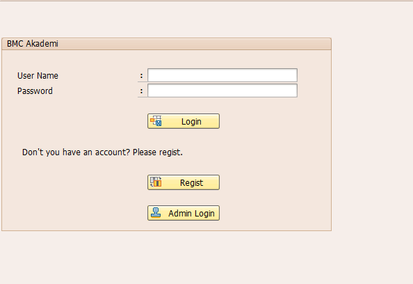
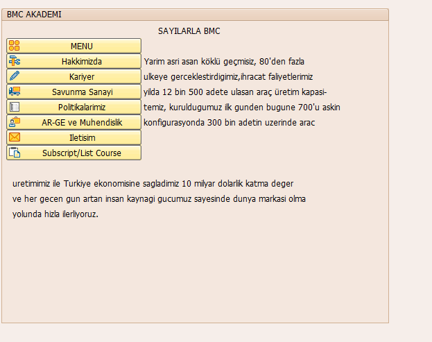
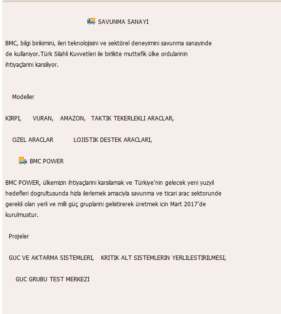
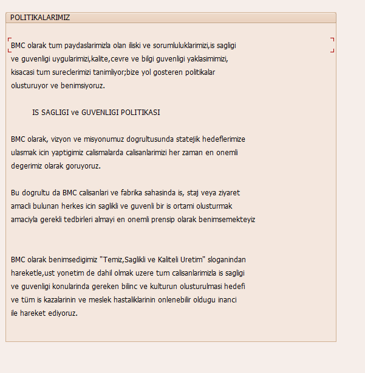
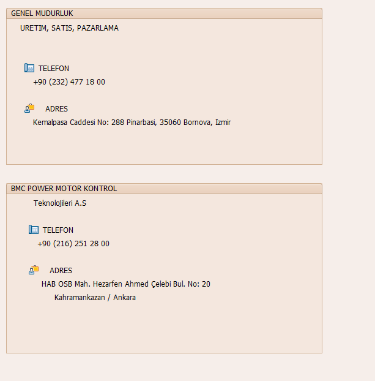
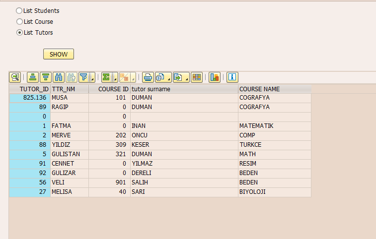
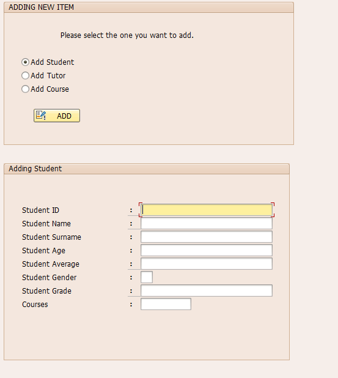
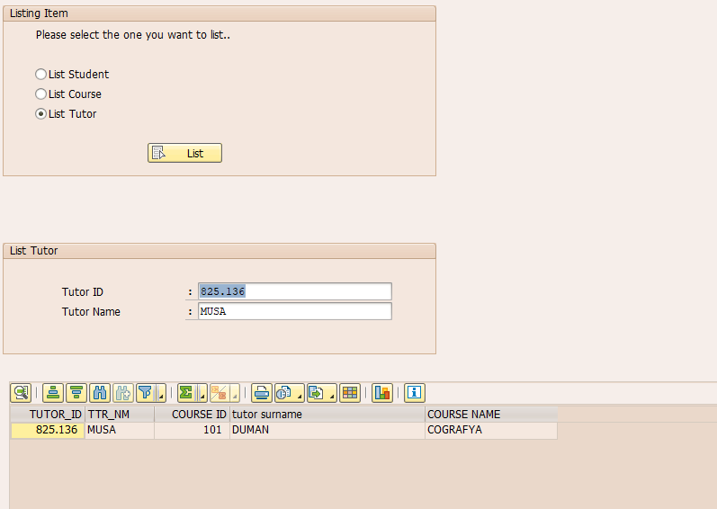
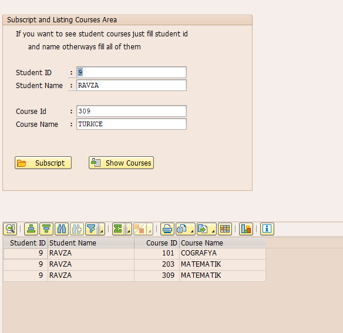
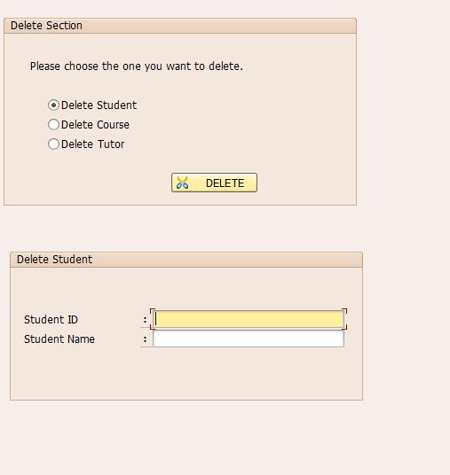

# BMC Akademi ABAP Project  

## 📌 About the Project  

This repository contains my ABAP training project developed during my internship at **BMC Otomotiv**.  
The project demonstrates various SAP ABAP concepts and best practices, including:  

- Modularized code with `INCLUDE` structures  
- Screen (Dynpro) design and navigation  
- Data handling and processing logic  
- Form routines for better code organization  

The source files are stored under the `src_report` folder:  

- `Z_BMCAKADEMI_TOP` – Global data and type definitions  
- `Z_BMCAKADEMI_INPUT` – User input handling  
- `Z_BMCAKADEMI_OUTPUT` – Output display logic  
- `Z_BMCAKADEMI_PBO` – Processing Before Output logic  
- `Z_BMCAKADEMI_FORM` – Commonly used form routines  
- `Z_BMCAKADEMI_REPORT.ABAP` – Main program entry point  

---

## 🚀 How to Run  

1. Import all files into your SAP system.  
2. Activate each program/include in the correct order.  
3. Run the main report `Z_BMCAKADEMI_REPORT`.  

  
  
  
  
  
  
  
  
  
  
  
  
  
